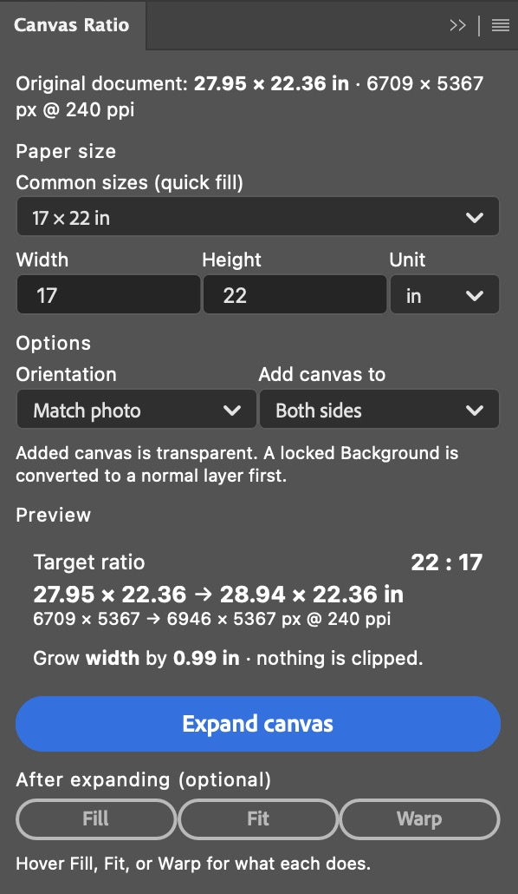

# Canvas Ratio

A Photoshop panel that expands your photo's canvas to a chosen print paper ratio
**without ever cropping the image**, then helps you fit the photo to the new frame.

<p align="center">
  
</p>

## Why you'd want it

When you mat a photo onto a fixed paper size (17×22, 16×20, A4, 5×7…), Photoshop's
**Canvas Size crops** the moment a target dimension is smaller than your image. There's
no built-in "just add canvas to reach this ratio" command.

Canvas Ratio does exactly that: it keeps your image as-is and grows **only the one side**
needed to reach the paper ratio. Because it only ever *adds* canvas, **nothing is cropped**
and the added border is transparent. You see the exact new size before you commit.

## How to use it

1. **Open your photo.** The **Input** section shows its size, pixel dimensions, and pixel
   density, and keeps them current as you edit or switch documents.
2. **Choose the target paper size.** Pick a preset (US frame sizes and EU A-series; each
   entry shows its aspect ratio, e.g. `16 × 20 in (4:5)`), or type any **Width × Height**
   and choose your unit (in / cm / mm). Editing the fields switches the preset to **Custom…**.
3. **Set the options:**
   - **Orientation:** match your photo, or force landscape / portrait.
   - **Add canvas to:** both sides (centered) or biased to one edge.
4. **Read the Output preview.** It shows the **target ratio** as raw plus reduced
   (e.g. `20:16 (5:4)`), the **new size** in your unit and pixels, and how much canvas will
   be added, e.g. *"Adds 0.99 in (238 px) of width, with nothing cropped."* If your canvas
   already matches the ratio, **Expand canvas** is disabled.
5. **Click Expand canvas.** The canvas grows to the ratio with a transparent border and your
   image is untouched. (A locked *Background* becomes a normal layer so the border can be
   transparent.) Undo (⌘Z) restores it.

Good to know: the added border is **transparent**, so flatten or add your own background
layer if you want a white (or colored) mat for printing. Expanding changes only the canvas
ratio, not your print resolution; your photo keeps its original pixels and PPI.

### After expanding (optional)

Scale your photo within the new frame:

- **Fill:** scale up to cover the whole canvas (anything past the edges is cropped).
- **Fit:** scale to sit fully inside the canvas (transparent margins remain).
- **Warp:** stretch to fill the canvas exactly (slight distortion, nothing cropped).

## Installing

1. Download the latest **`Canvas-Ratio-x.y.z.ccx`** from the
   [**Releases**](https://github.com/valentinozegna/canvas-calculator/releases/latest) page.
2. Make sure the **Creative Cloud desktop app** is installed and running.
3. **Double-click the `.ccx`.** Creative Cloud installs it automatically.
4. Open **Photoshop**. The **Canvas Ratio** panel appears under the **Plugins** menu.

> Requires Photoshop 2024 (24.0) or newer.

Tip: dock the panel alongside your other Photoshop panels.

<details>
<summary>Install from source instead (UXP Developer Tool)</summary>

1. In the **Creative Cloud desktop app**, install the free **UXP Developer Tool (UDT)**.
2. [Download the source](https://github.com/valentinozegna/canvas-calculator) (green
   **Code → Download ZIP**) and unzip it somewhere permanent.
3. Open **Photoshop**, then in **UDT** click **Add Plugin** and select the plugin's
   `manifest.json`.
4. Click **Load**. The panel appears under Photoshop's **Plugins** menu.

</details>

## License

[MIT](LICENSE) © 2026 Valentino Zegna

---

<details>
<summary>For developers</summary>

Plain HTML/JS UXP plugin, no build step. The pure ratio math lives in
[`ratio.js`](ratio.js) (no Photoshop dependency) and is unit-tested.

```bash
npm install     # dev tooling only (ESLint)
npm test        # run the ratio math unit tests
npm run lint    # ESLint
npm run icons   # regenerate panel icons
npm run stage   # copy runtime-only files into build/canvas-ratio/ for packaging
```

- **Debug:** in UDT, use the plugin's ••• → **Debug** to open DevTools for the panel.
- **Reload:** after editing source, click **Reload** in UDT. Manifest changes need a full
  unload/reload, plus a workspace reset or relaunch to pick up new panel sizes.
- **Package:** run `npm run stage`, then in UDT **Add Plugin** → `build/canvas-ratio/manifest.json`
  and ••• → **Package**. Staging keeps `.git/`, `node_modules/`, and tests out of the `.ccx`.
  Double-clicking the resulting `.ccx` installs it via the Creative Cloud desktop app.
- **Publishing:** a public Marketplace listing needs a real plugin ID from Adobe's
  [Developer Distribution](https://developer.adobe.com/distribution/) portal, replacing the
  placeholder `com.valentino.canvasratio` in [`manifest.json`](manifest.json).

</details>
